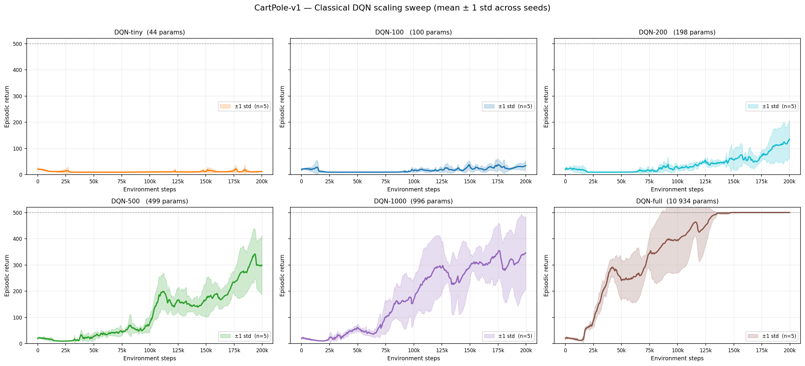
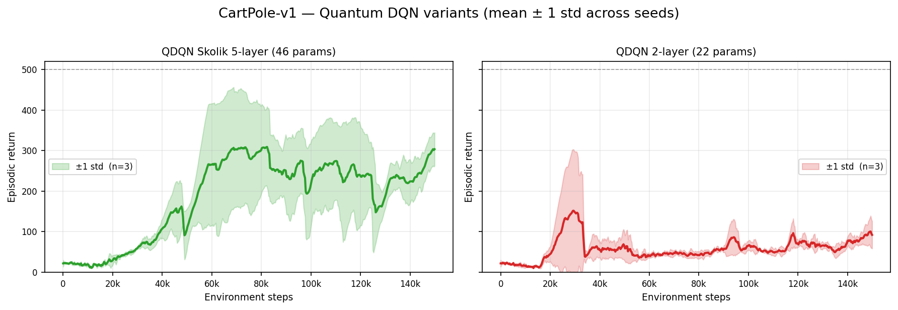
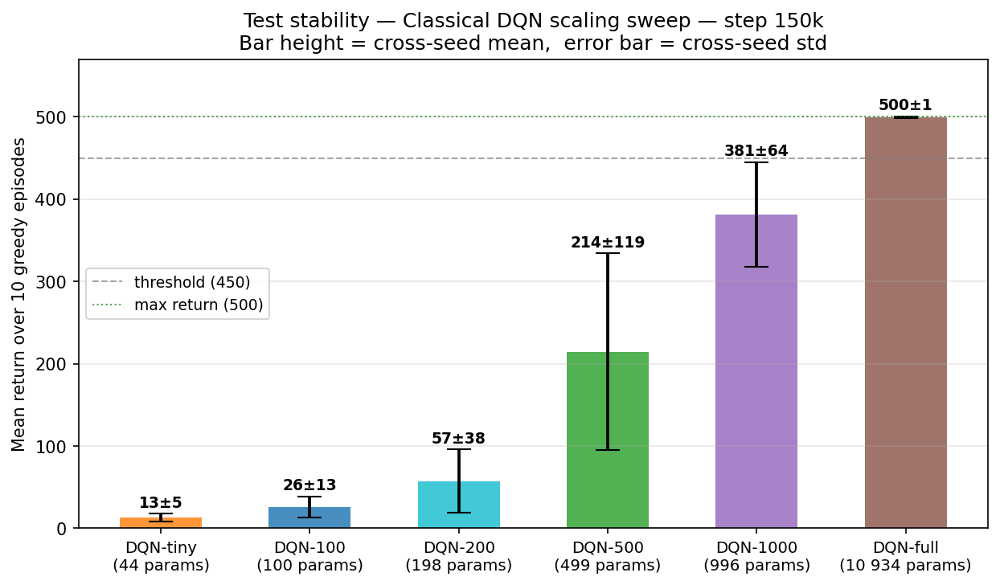
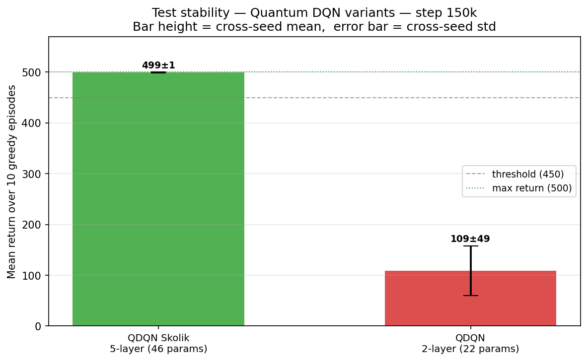

# Hybrid Quantum-Classical DQN for CartPole-v1

**QML Researcher Assignment - Terra Quantum**

---

## 1. Framing

**Research question.** Does the quantum layer contribute anything beyond what a parameter matched classical layer provides on CartPole-v1, and if so, under what conditions?

My approach was to select an RL algorithm suitable for CartPole-v1, implement the classical baseline first, and verify it works. I then learned quantum circuits and implemented a basic ansatz for training. I observed training output, tried different ansatz configurations with varying parameters, and compared results against the classical baseline.

**Centre of gravity.** Part B (the empirical study). Time was split roughly as follows.

- Part B (experiments and analysis): 50%
- Part A (library and infrastructure): 35%
- Part C (fault tolerance probe): 15%

The major focus was Part B: running experiments to find conditions where the quantum layer helps. The next focus was Part A: making the code modular, config-driven, and installable. For Part C, I took the C1 path and analysed T-gate count and depth, and what those numbers mean for running the model on fault-tolerant hardware.

**What I did not do.** I ran only 3 seeds for the quantum agents instead of 5, due to each seed taking 6 to 8 hours of CPU time before the laptop thermal throttled. I ran only two quantum configurations. Ideally I would run 5 or more seeds across 4 to 6 ansatz configurations. The limited seed count is the main caveat on the results and is stated clearly wherever the quantum numbers appear.

---

## 2. Library Design

### Starting point

I started from [CleanRL's](https://github.com/vwxyzjn/cleanrl) single-file DQN implementation as a reference for the training loop. CleanRL is a well-maintained open source library with clean, readable DQN code. I had previously used CleanRL, so it was straightforward to get a working classical baseline. I then restructured it into a config-driven, installable package so that agent and environment settings could be changed without touching code.

### Key abstractions

**BaseAgent (abstract base class).** The only interface the training loop depends on. Any agent, classical or quantum, must implement four methods: `select_action`, `update`, `save`, and `load`. The Trainer never imports a specific agent class. Swapping quantum for classical is a config change, not a code change.

**AGENT_REGISTRY and build_agent factory.** A plain dict mapping string keys to agent classes. Adding a new agent is one line: `AGENT_REGISTRY["my_agent"] = MyAgent`. The training CLI reads `agent_type` from the YAML config and routes through this registry.

**Trainer.** An agent-agnostic training loop. It handles environment stepping, epsilon schedule, replay buffer sampling, TensorBoard logging, and checkpointing. It calls only `agent.select_action`, `agent.update`, and `agent.on_step`. No agent-specific logic lives here.

**ReplayBuffer.** A standard circular buffer.

### Config-driven experiments

All hyperparameters live in YAML files under `configs/`. No values are hardcoded in scripts. Switching between agents requires changing one field (`agent_type`) in the config file. The environment settings (max steps, reward clipping, seed) are in a separate `env.yaml`. This makes reproducing any specific run a one-line command.

### What I deliberately did not abstract

- No ansatz registry or pluggable circuit builder. The quantum circuit is defined directly in `qdqn_skolik.py`. Adding a new ansatz means adding a new python file with agent class code.
- No environment wrapper. CartPole-v1 is the only environment used. Abstracting over environments would be premature given the time budget.
- No hyperparameter search infrastructure. Grid search tooling was out of scope.

### Package structure

```
src/qrl_cartpole/
    agents/
        base_agent.py      BaseAgent ABC
        dqn_agent.py       classical DQN
        qdqn_skolik.py     Skolik 2022 quantum agent
    training/
        trainer.py         agent-agnostic training loop
    utils/
        replay_buffer.py   replay buffer
    evaluate.py            evaluation function
```

The package is installable with `pip install -e .` and a single `bash setup_env.sh` command creates the virtual environment and installs all dependencies.

---

## 3. Experimental Setup

### Algorithm choice

I used DQN as the RL backbone. The reasons are:

- CartPole-v1 has a discrete action space (push left or push right), which maps directly to DQN's Q-value output per action.
- The primary reference papers for this exact task (Lockwood and Si 2020, Skolik et al. 2022) both use DQN or Q-learning variants.
- The quantum swap is clean. Replace the Q-network (a neural net) with a variational quantum circuit, keep everything else identical. This makes the comparison between classical and quantum as direct as possible.
- DQN has fewer hyperparameters than actor-critic methods, which makes the comparison easier to control.

### Agents and parameter counts

| Agent | Architecture | Parameters | Notes |
|---|---|---|---|
| DQN | FC layers [120, 84] with ReLU | 10,934 | Full classical baseline |
| DQN-tiny | FC layer [6] with ReLU | 44 | Matched to QDQN-Skolik |
| DQN-100 | FC layer [14] with ReLU | 100 | Scaling sweep |
| DQN-200 | FC layer [28] with ReLU | 198 | Scaling sweep |
| DQN-500 | FC layer [71] with ReLU | 499 | Scaling sweep |
| DQN-1000 | FC layer [142] with ReLU | 996 | Scaling sweep |
| QDQN-Skolik | 4 qubits, 5 layers | 46 | Primary quantum agent |
| QDQN-2layer | 4 qubits, 2 layers | 22 | Depth ablation |

DQN-tiny is the parameter-matched baseline for QDQN-Skolik. It has 44 parameters versus 46, which is as close as the architecture allows with integer hidden sizes.

### QDQN-Skolik circuit

The ansatz follows Skolik et al. 2022 (Table 2, best configuration). The circuit runs on 4 qubits with 5 repeated layers.

- **Encoding.** Before each layer, apply `RX(arctan(w_input * obs))` on each qubit. This is data re-uploading: the observation is encoded at every layer, not just at the start. The input weights `w_input` are trainable.
- **Variational gates.** After encoding, apply `RY(theta)` and `RZ(phi)` per qubit per layer. These are the main trainable parameters.
- **Entanglement.** CZ gates in a daisy-chain ring: qubit 0 to 1, 1 to 2, 2 to 3, 3 to 0.
- **Measurement.** Two joint ZZ observables: `Z0 x Z1` and `Z2 x Z3`. These produce two scalar outputs per forward pass.
- **Output scaling.** `Q = w_output * (1 + ZZ) / 2`. The output weights `w_output` are trainable and there is one per action.

Three separate learning rates are used following Skolik's recommendation: VQC weights at 0.001, input weights at 0.01, output weights at 0.1.

QDQN-2layer is the same circuit with n_layers=2, which reduces parameters from 46 to 22. This tests whether the 5-layer depth is necessary for learning.

### Shared hyperparameters

| Parameter | DQN variants | QDQN variants |
|---|---|---|
| Total timesteps | 200,000 | 150,000 |
| Learning starts | 10,000 | 10,000 |
| Train frequency | every 10 steps | every 10 steps |
| Buffer size | 10,000 | 10,000 |
| Batch size | 128 | 16 (per Skolik) |
| Discount factor gamma | 0.99 | 0.99 |
| Target network frequency | 500 steps | 30 steps |
| Epsilon start | 1.0 | 1.0 |
| Epsilon end | 0.01 | 0.01 |
| Exploration fraction | 10% of timesteps | 10% of timesteps |

QDQN runs fewer total timesteps (150k vs 200k) because each step takes much longer on the PennyLane simulator and the laptop thermal throttled during extended runs. The exploration fraction and epsilon schedule match across all agents for a fair comparison.

The DQN scaling sweep (100 to 1000 params) uses the same hyperparameters as the full DQN. These were not re-tuned per network size, which is a limitation discussed in Section 7.

### Seeds and compute

- DQN, DQN-tiny, DQN scaling variants: 5 seeds each (2574, 8805, 3545, 5181, 8071)
- QDQN-Skolik, QDQN-2layer: 3 seeds each (2574, 3545, 5181)

All runs on CPU under WSL2 (Ubuntu) on Windows. Hardware: Intel Core Ultra 7 155H (11 cores, 22 threads), 8 GB RAM available to WSL2. Classical DQN trains in approximately 2 minutes per run. QDQN-Skolik takes 6 to 8 hours per run with PennyLane lightning.qubit backend and adjoint differentiation. The seed count asymmetry is a direct consequence of this wall-clock cost. After each quantum run the laptop required a restart due to thermal throttling. Running more seeds was not feasible within the time budget.

Total time spent on the project: approximately 25 hours across 5 days.

---

## 4. Usefulness Metrics

### What I measured

**Final test return (mean and std across seeds).** Greedy policy evaluated for 10 episodes at the checkpoint nearest to step 150k. This is the primary outcome measure. Higher is better, maximum is 500.

**Cross-seed standard deviation.** Measures how reliably a configuration learns across different random seeds. A configuration with high mean but high std is unreliable. A configuration with low std is reproducible.

**Training curve shape and variance.** The mean plus or minus one std band of episodic return over training steps, computed from TensorBoard event files across all seeds. This shows how reliably each configuration learns over time, not just the final outcome. It also reveals whether a model converges smoothly or oscillates.


### Reasons for these choices

CartPole-v1 saturates at 500, making final return a coarse signal for well-performing agents. Cross-seed std and training curve variance add information beyond the ceiling. They answer a different question: not just does it work, but does it work reliably and consistently.

### Where these metrics fall short

Final return on a saturating environment cannot distinguish between agents once they both hit 500. The full DQN (10,934 params) and QDQN-Skolik (46 params) both score 500 and appear identical, even though their learning dynamics are very different.

### What else I would measure with more time

**Gradient variance over random initialisations.** A proxy for barren plateau risk. Measuring variance of parameter gradients over many random initialisations before any training is cheap and directly relevant to whether deeper ansatze will train reliably. Bowles et al. 2024 use this as a diagnostic.

**Expressibility (Sim et al. 2019).** How uniformly the circuit samples the Hilbert space across random parameter values. This connects the performance gap between the 5-layer and 2-layer configurations to a measurable circuit property, rather than treating the circuit as a black box.

---

## 5. Results

### Training curves



*Figure 1. Classical DQN scaling sweep. Mean episodic return plus or minus one std across 5 seeds. Panels ordered by parameter count: 44, 100, 198, 499, 996, and 10,934 parameters. The learning signal appears only above approximately 500 parameters with these hyperparameters.*



*Figure 2. Quantum DQN variants. Mean episodic return plus or minus one std across 3 seeds. Left: QDQN-Skolik 5-layer (46 params) learns consistently across seeds. Right: QDQN-2layer (22 params) shows a brief spike to near 500 around step 28k on some seeds, then collapses and fails to converge stably.*

### Test stability



*Figure 3. Greedy evaluation at step 150k for all classical DQN variants. 10 greedy episodes per seed, 5 seeds per configuration. Bar height is cross-seed mean. Error bars are cross-seed std.*



*Figure 4. Greedy evaluation at step 150k for both quantum variants. 10 greedy episodes per seed, 3 seeds per configuration.*

### Numerical results

**DQN classical scaling sweep (5 seeds each, step 150k):**

| Agent | Params | Cross-seed mean | Cross-seed std |
|---|---|---|---|
| DQN-tiny | 44 | 12.9 | 4.6 |
| DQN-100 | 100 | 25.8 | 12.8 |
| DQN-200 | 198 | 57.3 | 38.4 |
| DQN-500 | 499 | 214.5 | 119.4 |
| DQN-1000 | 996 | 381.1 | 63.8 |
| DQN-full | 10,934 | 499.6 | 0.8 |

**Quantum variants (3 seeds each, step 150k):**

| Agent | Params | Cross-seed mean | Cross-seed std |
|---|---|---|---|
| QDQN-Skolik | 46 | 499.4 | 0.9 |
| QDQN-2layer | 22 | 109.2 | 48.8 |

**Per-seed breakdown for quantum agents:**

| Agent | Seed | Mean | Std | Min | Max |
|---|---|---|---|---|---|
| QDQN-Skolik | 2574 | 498.1 | 5.7 | 481 | 500 |
| QDQN-Skolik | 3545 | 500.0 | 0.0 | 500 | 500 |
| QDQN-Skolik | 5181 | 500.0 | 0.0 | 500 | 500 |
| QDQN-2layer | 2574 | 71.2 | 19.2 | 43 | 113 |
| QDQN-2layer | 3545 | 78.4 | 17.6 | 61 | 121 |
| QDQN-2layer | 5181 | 178.1 | 128.6 | 53 | 477 |

### Answer to the research question

**The evidence suggests that the quantum layer contributes something the parameter matched classical layer cannot. The result is consistent across all 3 quantum seeds but 3 seeds is not enough to call it definitive.**

The core finding is this. QDQN-Skolik with 46 parameters scores 499.4 plus or minus 0.9 on all 3 seeds. DQN-tiny with 44 parameters (matched) scores 12.9 plus or minus 4.6 and fails completely on all 5 seeds. The gap between these two is not noise. Every DQN-tiny seed fails. Every QDQN-Skolik seed succeeds. The variational circuit with data re-uploading appears to provide a richer function approximation within the same parameter budget than a single-hidden-layer classical network.

**The classical scaling sweep adds context.** To reach performance in the same range as the 46-parameter QDQN-Skolik, a classical network needs roughly 1000 parameters and still does not reliably solve the task within 200k steps (DQN-1000 scores 381 plus or minus 64). A 499-parameter classical network scores 214 plus or minus 119. These networks were trained with hyperparameters designed for the full 10,934-parameter DQN, which likely disadvantages the smaller networks (see Section 7). Even so, the quantum agent with 46 parameters outperforms all classical networks below 10,934 parameters under these conditions.

**The QDQN-2layer ablation is informative.** Reducing from 5 layers to 2 layers (22 parameters) causes clear degradation. The agent does not converge stably. However, during training seed 5181 briefly hit a return of 500 around step 28k, which the full DQN (10,934 params) also did not reach that early. This suggests the 2-layer circuit has the capacity to represent a good policy but cannot hold it. The learning rate and training dynamics may be too aggressive for the smaller circuit at later steps, causing it to overfit and then diverge. This is worth investigating further.

**What this does not prove.** CartPole-v1 saturates at 500. The full DQN and QDQN-Skolik both hit the ceiling and appear identical. The meaningful comparison is QDQN-Skolik vs DQN-tiny, but DQN-tiny is a deliberately weak baseline by construction (a single hidden layer with 6 neurons is not a realistic classical model). A fairer comparison would use a two-layer classical network with exactly 46 parameters, and a harder environment where neither model saturates. The result here is a positive signal, not a proof of quantum advantage.

This is consistent with Skolik et al. 2022 and Lockwood and Si 2020, both of whom observe that low-parameter VQCs can approach larger classical networks on CartPole.

---

## 6. Fault Tolerance Probe

### What I did

I analysed the T-gate cost of the best-performing ansatz (QDQN-Skolik, 4 qubits, 5 layers) if compiled to fault-tolerant hardware using the Clifford plus T gate set. I also read Hao, Xu, and Tannu (ASPLOS 2026) on U3-based unitary synthesis as a T-gate reduction strategy, and investigated the trasyn library they open-sourced alongside the paper.

### T-gate count and depth

The circuit has 60 rotation gates per forward pass: 20 RX (encoding), 20 RY (variational), and 20 RZ (variational). It also has 20 CZ gates for entanglement. CZ is a Clifford gate and has low fault-tolerant cost.

Each rotation gate must be approximated in Clifford plus T using a synthesis algorithm such as gridsynth. Using the standard estimate of 3 times log base 2 of 1 over epsilon T gates per rotation gate at approximation error epsilon:

| Metric | Value |
|---|---|
| Non-Clifford rotation gates | 60 |
| Estimated T gates per rotation (epsilon = 0.001) | approximately 30 |
| Total estimated T count | approximately 1,794 |
| Estimated T depth | approximately 448 |

### What this means for fault-tolerant hardware

**Raw cost.** On fault-tolerant hardware each T gate requires magic state distillation. Distillation runs much slower than Clifford gates and consumes hundreds of physical qubits per logical qubit. At approximately 1,794 T gates per inference call, and with each T gate costing significantly more than Clifford operations, the per-step inference cost would be orders of magnitude slower than the classical DQN baseline.

**Data re-uploading is the deeper problem.** The RX encoding gates apply `arctan(w_input * obs)` where obs is the CartPole observation. The observation changes every timestep, so the circuit changes every timestep. On classical hardware, the program is fixed and only data changes. On fault-tolerant hardware, different rotation angles produce different Clifford plus T sequences. The circuit structure itself changes at every environment step. This means the 20 RX gates must be re-synthesised at every step, adding per-step compilation overhead on top of execution cost. The 40 trainable-weight gates (RY and RZ) could in principle be pre-compiled once after training. The observation-dependent gates cannot. This is fundamentally in tension with the static-circuit model that current fault-tolerant compilers assume.

Data re-uploading is the standard approach for VQC-based reinforcement learning (Skolik et al. 2022, Jerbi et al. 2021) and is necessary for the agent to condition on the current observation. 

**U3 fusion as a partial mitigation.** Hao et al. 2026 show that fusing adjacent single-qubit rotations (RX followed by RY followed by RZ per qubit per layer) into a single U3 unitary and synthesising that unitary directly reduces T count by a geometric mean of 1.38 times and up to 3.5 times compared to synthesising each gate separately with gridsynth. Applied to this circuit: 60 individual rotation targets would become 20 U3 targets, reducing estimated T count from approximately 1,794 to approximately 600. I read the paper, installed the trasyn library (which is open source), and confirmed it runs on CPU. I did not implement full synthesis on trained checkpoints due to hardware constraints and the complexity of the per-observation synthesis loop.

### Implications

Running this agent on near-term fault-tolerant hardware is not practical given the T-gate count and the data re-uploading requirement. Practical paths toward fault-tolerant execution would require one or more of the following.

- Removing data re-uploading and replacing it with an encoding strategy that separates input from circuit structure.
- Reducing circuit depth significantly, accepting some performance loss.
- Waiting for fault-tolerant compilers that can handle variable-angle circuits natively.

The U3 synthesis approach from Hao et al. 2026 is a promising direction for reducing T count on the trainable-weight portion of the circuit, but does not resolve the data re-uploading problem.

---

## 7. Limitations and Next Steps

### What would change the conclusion

**More seeds.** 3 seeds for the quantum agents is the primary weakness. A lucky 3-seed result is possible even for a consistently failing configuration. Running 7 to 10 seeds would give a much stronger statistical basis for the claim that QDQN-Skolik reliably solves CartPole-v1.

**A harder environment.** CartPole-v1 saturates at 500. The full DQN and QDQN-Skolik are indistinguishable at the ceiling. Testing on other environments would reveal whether the quantum advantage holds when there is room to distinguish good from excellent performance.

**Tuned hyperparameters for small classical networks.** The DQN scaling sweep (100 to 1000 params) uses hyperparameters tuned for the 10,934-parameter full DQN. Small networks likely need different learning rates, exploration schedules, and target update frequencies. The scaling sweep results should be read with this caveat in mind. With proper per-size hyperparameter tuning, the classical curves might improve.

**Investigation of the QDQN-2layer early peak.** During training, seed 5181 of the 2-layer QDQN briefly reached a return of 500 around step 28k, then collapsed. This is an interesting result. It suggests the 2-layer circuit has the representational capacity to solve CartPole-v1 but cannot stabilise the learned policy under continued training updates. Understanding why (learning rate too high at that point, optimizer momentum, or a structural issue with 2-layer entanglement) would be a useful investigation.

**Expressibility measurement.** Computing the expressibility metric from Sim et al. 2019 for the 5-layer and 2-layer configurations would explain the performance gap at the circuit level rather than treating it as a black box.

### What I would build next

**More ansatz configurations.** Run the comparison across different entanglement topologies (linear chain, full connectivity, ring), different numbers of qubits, and different observable choices. Bowles et al. 2024 provides a systematic evaluation framework for this. The architecture search in Part B is currently only two configurations, which is too few to draw conclusions about how circuit structure affects performance.

**Multi-environment evaluation.** Reproduce the QDQN-Skolik vs matched classical comparison on at least one harder environment (LunarLander or Acrobot) to test whether the positive result generalises beyond the saturating CartPole-v1 setting.

---

## 8. LLM Usage Disclosure

I used Claude (Anthropic) as a coding assistant throughout this project.

**Boilerplate and scaffolding.** The initial structure of BaseAgent, Trainer, and ReplayBuffer was generated with Claude prompts and then reviewed, modified, and in some places substantially rewritten. The YAML config structure and training loop were drafted with Claude assistance.

**Debugging.** Claude helped diagnose a few issues including Gymnasium 1.3 API differences around the final_info observation, PennyLane version compatibility problems, and TensorBoard logging. 

**Report.** The structure and some phrasing in this report were drafted with Claude assistance, then revised to reflect my own understanding and conclusions.

In all cases I reviewed the output and decided what to keep. I identified where the LLM made errors, including an early suggestion to restructure the data re-uploading encoding that would have broken the Skolik comparison. All experimental design decisions, hyperparameter choices, and conclusions are my own. The key choices (DQN rather than PPO, Skolik ansatz as primary reference, parameter-matched baseline requirement, the specific issues fixed during QDQN training) were made by reading the literature and running the experiments myself.

---

## References (all papers are presented in papers folder)

- Lockwood, O. and Si, M. (2020). Reinforcement Learning with Quantum Variational Circuit. arXiv:2008.07524.
- Skolik, A. et al. (2022). Quantum agents in the Gym. arXiv:2103.15084.
- Jerbi, S. et al. (2021). Parametrized Quantum Policies for Reinforcement Learning. NeurIPS 2021. arXiv:2103.05577.
- Meyer, J.J. et al. (2023). A Survey on Quantum Reinforcement Learning. arXiv:2108.06849.
- Bowles, J. et al. (2024). Dissecting Quantum Reinforcement Learning. arXiv:2511.17112.
- Sim, S. et al. (2019). Expressibility and Entangling Capability of Parameterized Quantum Circuits. Quantum Machine Intelligence.
- Hao, T., Xu, A., and Tannu, S. (2026). Reducing T Gates with Unitary Synthesis. ASPLOS 2026.
- Liang, S. et al. (CleanRL). CleanRL: High-quality Single-file Implementations of Deep RL Algorithms. https://github.com/vwxyzjn/cleanrl.
